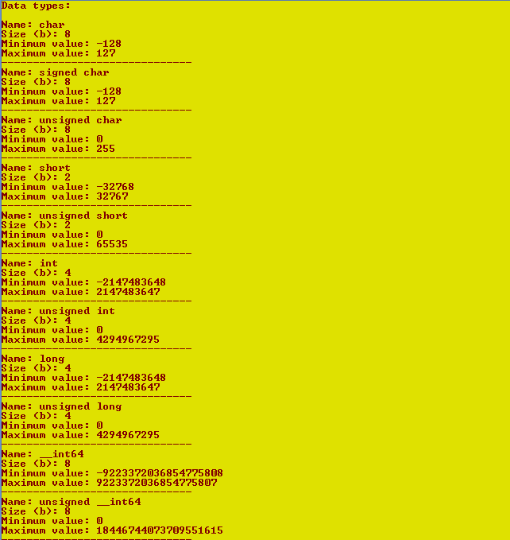
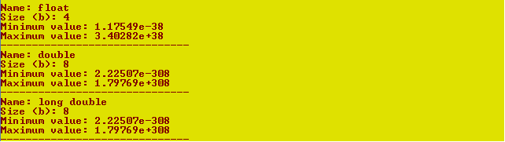

# Отчет для лабораторной работы №0
**Тема**:Восстановление знаний о языке C/C++, а так же среде разработки Visual Studio.   

**Задание**:Необходимо написать программу, которая выведет все простейшие типы данных, их размеры в байтах, а так же диапазон значений (т.е. минимальное и максимальное значение для каждого типа данных).   

**Выполнение работы**:   

