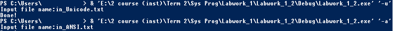

# Отчет для лабораторной работы №1
**Тема**: Изучение системных вызовов Win32 API, позволяющих получить информацию об ошибке. Изучение функций сбора информации о системе.   
  
**Задание**:   
1. Необходимо написать программу, которая бы генерировала ошибку в ходе выполнения системного вызова и выдавала системное описание данной ошибки. Вторым режимом работы данной программы должен быть вывод информации о состоянии системы. Режим запуска программы определяется ключом, передаваемым в командной строке (-e – печать ошибки, -s – печать информации о системе).
1. Написать программу, позволяющую выполнять перекодировку текста из ASCII в Юникод и обратно. В качестве входных данных выступает файл с текстом. Программа при запуске получает параметр командной строки определяющий исходную кодировку файла (-a – ANSI файл, -u – Юникод файл).

**Выполнение работы**:   
## Задание 1

## Задание 2

