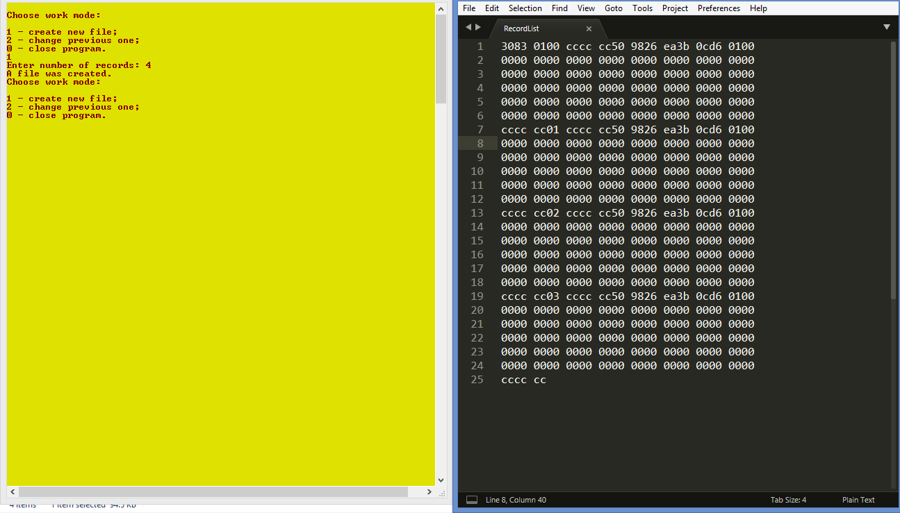
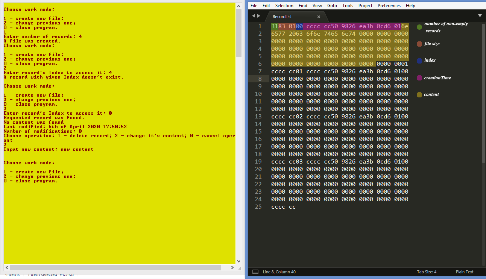
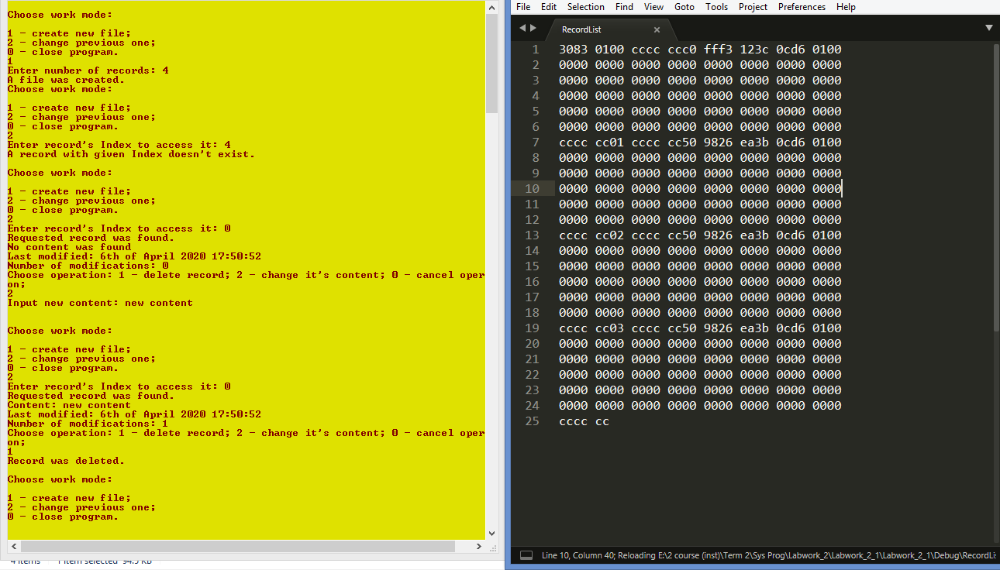
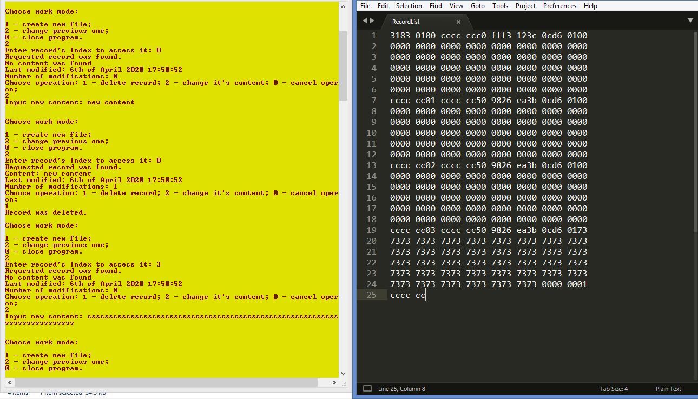
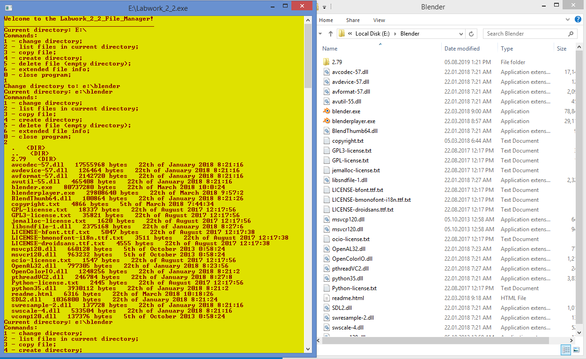
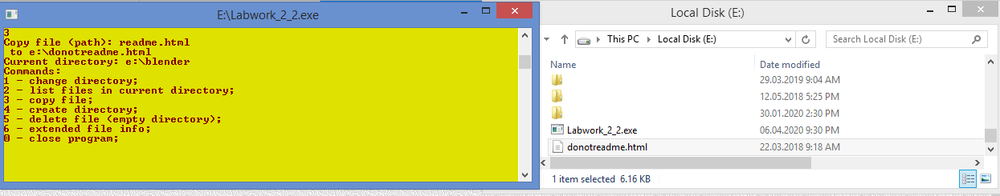
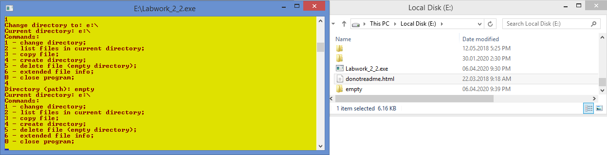
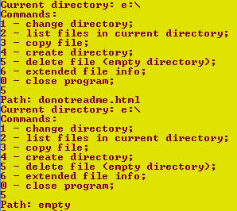
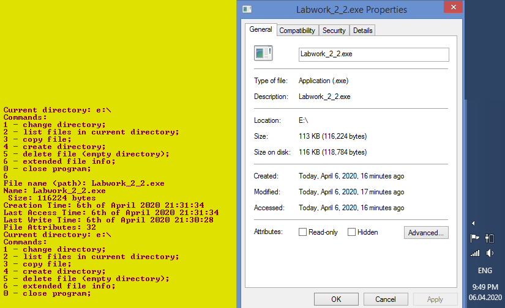

# Отчет для лабораторной работы №2
**Тема**: 1.	Изучение системных вызовов Win32 API работы с файлами.
  
**Задание**:   
1. Написать программу, реализующую произвольный доступ к записям в файле с помощью указателя файла (file pointer).

Структура записи:
  * номер записи;
  * время создания записи (в формате FILETYME);
  * текстовая строка заданной длины (80 символов);
  * счетчик, показывающий, сколько раз запись изменялась.

Запись может быть пустая (инициализирована нулями).
В заголовке файла хранить количество непустых записей в файле и размер файла. Общее количество записей в файле задается из командной строки. Пользователь должен иметь возможность удалять и модифицировать существующие записи, обращаясь к ним по номеру. Интерфейс с пользователем реализуется на усмотрение студента.

 

2. Написать программу, реализующую функцию файлового менеджера. Программа должна выдавать приглашение на ввод команды. Поддерживаемые команды:
  * Сменить директорию
  * Распечатать директорию
  * Скопировать файл
  * Создать директорию
  * Удалить файл (пустую директорию)
  * Вывести подробную информацию о файле

**Выполнение работы**:   
## Задание 1

## Задание 2

