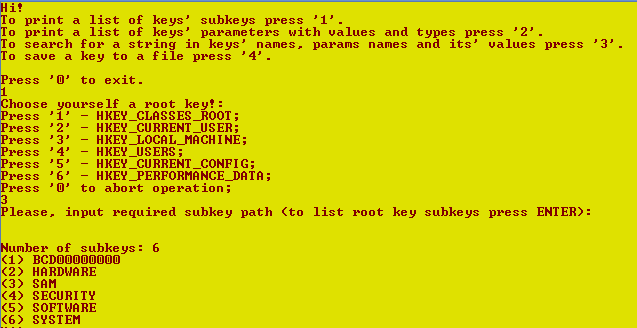
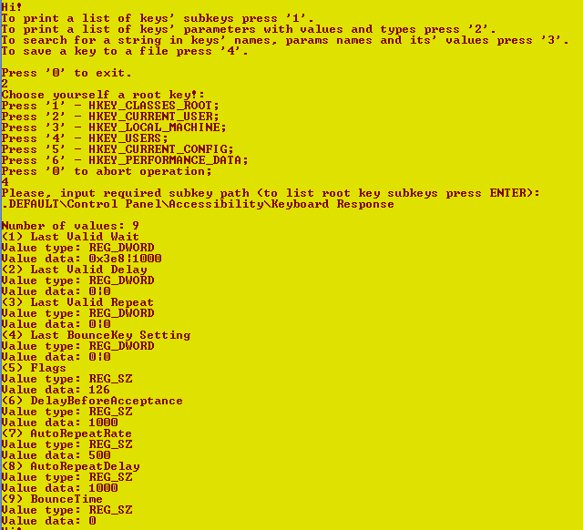
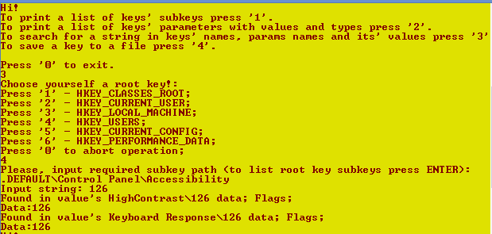
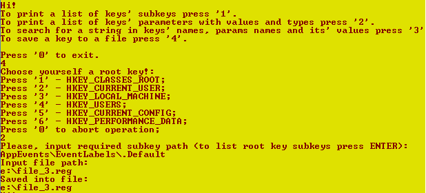

# Отчет для лабораторной работы №3
**Тема**: Изучение системных вызовов Win32 API работы с реестром.

**Задание**:   
Требуется разроботать программу работы с реестром, которая бы реализовывала такие функции:
1.	По имени ключа выводит перечень подключей
2.	По имени уключа выводит перечень параметров ключа с их значением и типами
3.	Выполняет поиск по реестру заданной строки в названиях ключей, названиях параметров и их значениях. Ключ относительно которого выполнять поиск задается пользователем.
4.	Выполняет выгрузку заданного пользователем ключа в виде файла.

Программа может иметь оконный или консольный интерфейс. Название ключей подаются с клавиатуры путем интерактивного ввода.
  

 **Выполнение работы**:   

