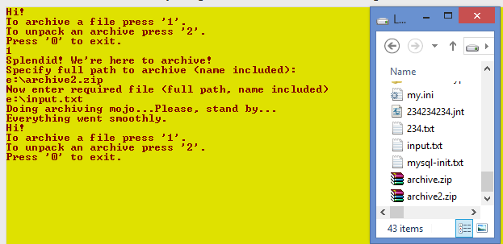
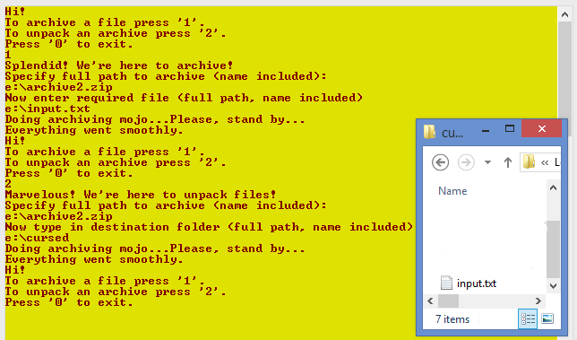
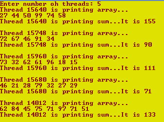

# Отчет для лабораторной работы №4
**Тема**: Изучение системных вызовов Win32 API работы с процессами и потоками.

**Задание**:   
1. Написать программу, реализующую упаковку и распаковку zip архивов. Программа должна использовать утилиту 7z.exe, 
которая будет непосредственно выполнять упаковку и распаковку файлов путем запуска в дочернем процессе. 
Программа должна поддерживать такие операции как:
  * Распаковка архива в папку;
  * Упаковка одного файла в новый архив;
 Для получения максимальной оценки необходимо выполнить обработку ошибок от дочернего 
 процесса путем перенаправления потока вывода. Это позволит родительскому процессу получить содержимое консоли, 
 сформированное программой 7z.exe и по этому тексту определить была ошибка или нет.
  
 
 2. Написать программу, которая может создавать 2 и более потоков (кол-во задается в командной строке). 
 Перед запуском потоков программа заполняет для каждого потока исходный массив целочисленных значений (5-10 элементов) 
 от 10 до 100. Каждый поток должен найти для каждого элемента массива его наибольший делитель, 
 сохраняя полученные значения в TLS память. После нахождения всех значений он должен вывести сумму всех полученных 
 значений и напечатать свой идентификатор. 
 Расчет наибольшего делителя и вычисление конечной суммы должны реализовываться двумя отдельными функциями.
 
 **Выполнение работы**:   
## Задание 1

## Задание 1

