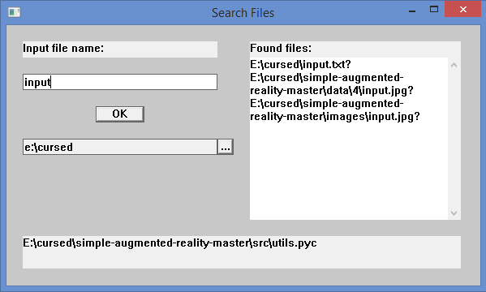

# Отчет для лабораторной работы №6
**Тема**: Создание оконных приложений с помощью win32 API.

**Задание**:   
Требуется разработать оконное приложение с SDI интерфейсом, 
которое будет реализовывать функцию поиска файла по имени в заданном каталоге и подкаталогах. 
Поиск должен выполняться в отдельном потоке, чтобы приложение продолжало отвечать на действия пользователя. 
Плюс должна идти визуализация процесса поиска: или в виде бегущего прогресс бара или в виде вывода имени 
с полным путем проверяемых каталогов. Так же можно реализовать приостановку процесса поиска путем перевода 
потока по запросу пользователя в приостановленное состояние.
1.	Программа должна использовать оконный интерфейс, организованный с помощью Win32 API функций. Интерфейс должен содержать:
 *  Поле ввода имени искомого файла;
 *  Кнопка старта поиска;
 *  поле ввода каталога, в котором выполнять поиск;
 *  рядом с полем ввода каталога кнопка, которая открывает диалог выбора каталога (SHBrowseForFolder);
 *  Многострочное поле или список, в который будут выводиться имена найденных файлов с полным путем;
 *  Область визуализации процесса поиска;
 *  По желанию: кнопка приостановки и возобновления поиска.
Программа должна реализовать обработку нажатия на кнопку поиска в виде функции, запускаемой в отдельном потоке.
  

 **Выполнение работы**:   

