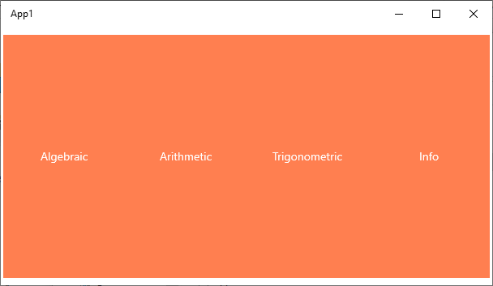
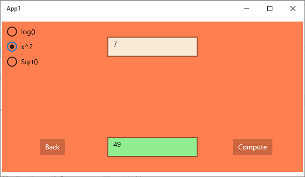
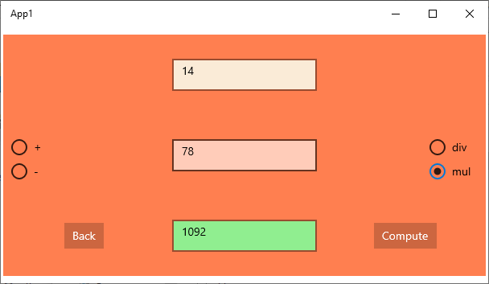
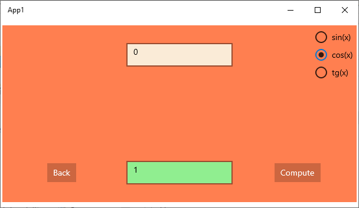
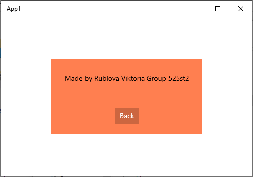

# Отчет для лабораторной работы №7
**Тема**: Создание Universal Windows Application для Windows 10 на базе UWP

**Задание**:   
Необходимо создать оконное приложение, которое будет построено на базе проекта Universal Windows Application. 
Данное приложение должно будет включать 3 страницы:
 *  Стартовая, построенная на базе одного из трех типовых элементов управления (выбрать согласно варианту задания).
 *  Страница с информацией о разработчике.
 *  Страница с реализацией, указанной в варианте задания, функции.
 
Разметка стартовой страницы выполняется на базе Nav Pane 
( SplitView Class - https://msdn.microsoft.com/en-us/windows/uwp/controls-and-patterns/nav-pane)

Дополнительное задание:
1. Выполнить алгебраический калькулятор с корнем, логарифмом и степенями
1. Выполнить арифметический калькулятор: сложение, вычитание, деление и умножение
1. Выполнить тригонометрический калькулятор: sin, cos, tn
 
  

 **Выполнение работы**:   

