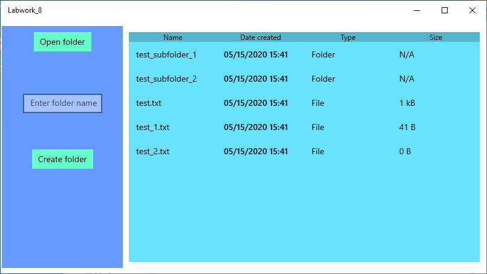
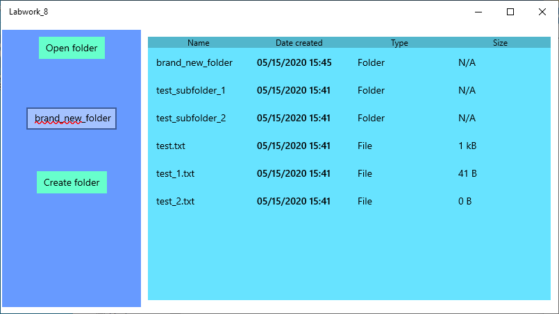
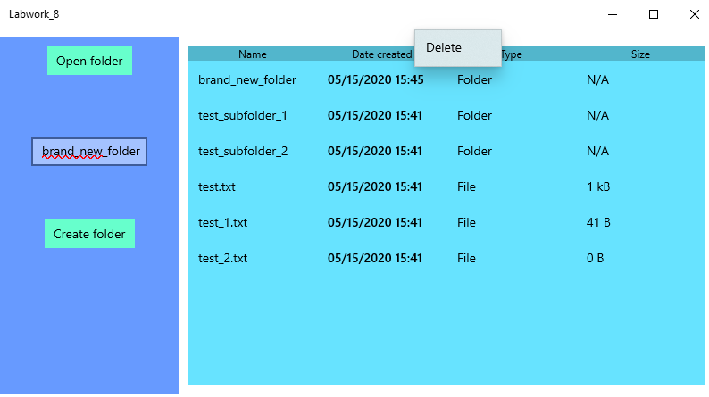

# Отчет для лабораторной работы №8
**Тема**: Создание Universal Windows Application для Windows 10 на базе UWP.
Работа с файловой системой через классы Windows.Storage.

**Задание**:   
Необходимо создать оконное приложение, которое будет реализовывать функции файлового менеджера:
 *  Отображать перечень файлов и папок в заданном каталоге.
 *  Переходить в подкаталог по клику на папку.
 *  Отображать для списка файлов размер (приведенный к Байтам, Кбайтам, МБайтам), дату создания, имя файла.
 *  Предоставлять возможность смены каталога через FolderPicker

Интерфейс должен быть выполнен на базе одной страницы: 
Список файлов и дополнительные кнопки все размещаются одновременное на одной странице.

Дополнительное задание:
Предоставить возможность создать или удалить папку
 
  

 **Выполнение работы**:   

